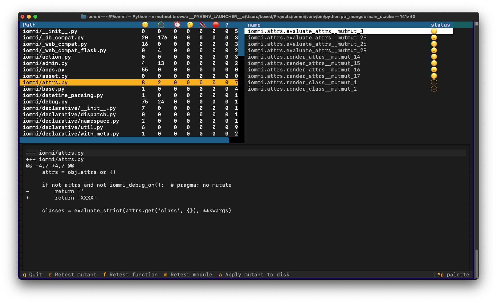

mutmut - python mutation tester
===============================

.. image:: https://github.com/boxed/mutmut/actions/workflows/tests.yml/badge.svg
    :target: https://github.com/boxed/mutmut/actions/workflows/tests.yml

.. image:: https://readthedocs.org/projects/mutmut/badge/?version=latest
    :target: https://mutmut.readthedocs.io/en/latest/?badge=latest
    :alt: Documentation Status

Mutmut is a mutation testing system for Python, with a strong focus on ease
of use. If you don't know what mutation testing is try starting with
`this article <https://kodare.net/2016/12/01/mutmut-a-python-mutation-testing-system.html>`_.

Some highlight features:

- Found mutants can be applied on disk with a simple command making it very
  easy to work with the results
- Remembers work that has been done, so you can work incrementally
- Knows which tests to execute, speeding up mutation testing
- Interactive terminal based UI
- Parallel and fast execution

If you want to mutate code outside of functions, you can try using mutmut 2,
which has a different execution model than mutmut 3+.

Requirements
------------

Mutmut must be run on a system with `fork` support. This means that if you want
to run on windows, you must run inside WSL.

Install and run
---------------

You can get started with a simple:

.. code-block:: console

    pip install mutmut
    mutmut run

This will by run pytest on tests in the "tests" or "test" folder and
it will try to figure out where the code to mutate is.

You can stop the mutation run at any time and mutmut will restart where you
left off.

Incremental Testing
~~~~~~~~~~~~~~~~~~~

Mutmut is designed for incremental workflows. It remembers which mutants have
been tested and their results, so subsequent runs skip already-tested mutants.

**Function-level change detection:** Mutmut computes a hash of each function's
source code. When you modify a function, mutmut detects the change and
automatically re-tests all mutants in that function. Unchanged functions keep
their previous results.

**Limitation:** Change detection only tracks direct function changes, not
transitive dependencies. If function A calls function B, and you modify B,
mutants in A are not automatically re-tested. For significant changes to
shared utilities, use ``mutmut run "module*"`` to re-test affected modules,
or delete the ``mutants/`` directory for a full re-run.

This means you can:

- Run ``mutmut run``, stop partway through, and continue later
- Modify your source code and re-run - only changed functions are re-tested
- Update your tests and use ``mutmut browse`` to selectively re-test mutants

The mutation data is stored in the ``mutants/`` directory. Delete this
directory to start completely fresh.

To work with the results, use `mutmut browse` where you can see the mutants,
retest them when you've updated your tests.

You can also write a mutant to disk from the `browse` interface, or via
`mutmut apply <mutant>`. You should **REALLY** have the file you mutate under
source code control and committed before you apply a mutant!

If during the installation you get an error for the `libcst` dependency mentioning the lack of a rust compiler on your system, it is because your architecture does not have a prebuilt binary for `libcst` and it requires both `rustc` and `cargo` from the [rust toolchain](https://www.rust-lang.org/tools/install) to be built. This is known for at least the `x86_64-darwin` architecture.

Wildcards for testing mutants
-----------------------------

Unix filename pattern matching style on mutants is supported. Example:

.. code-block:: console

    mutmut run "my_module*"
    mutmut run "my_module.my_function*"

In the `browse` TUI you can press `f` to retest a function, and `m` to retest
an entire module.

Configuration
-------------

In `setup.cfg` in the root of your project you can configure mutmut if you need to:

.. code-block:: ini

    [mutmut]
    paths_to_mutate=src/
    pytest_add_cli_args_test_selection=tests/

If you use `pyproject.toml`, you must specify the paths as array in a `tool.mutmut` section:

.. code-block:: toml

    [tool.mutmut]
    paths_to_mutate = [ "src/" ]
    pytest_add_cli_args_test_selection= [ "tests/" ]

See below for more options for configuring mutmut.

"also copy" files
~~~~~~~~~~~~~~~~~

To run the full test suite some files are often needed above the tests and the
source. You can configure to copy extra files that you need by adding
directories and files to `also_copy` in your `setup.cfg`:

.. code-block:: ini

    also_copy=
        iommi/snapshots/
        conftest.py

Limit stack depth
~~~~~~~~~~~~~~~~~

In big code bases some functions are called incidentally by huge swaths of the
codebase, but you really don't want tests that hit those executions to count
for mutation testing purposes. Incidentally tested functions lead to slow
mutation testing as hundreds of tests can be checked for things that should
have clean and fast unit tests, and it leads to bad test suites as any
introduced bug in those base functions will lead to many tests that fail which
are hard to understand how they relate to the function with the change.

You can configure mutmut to only count a test as being relevant for a function
if the stack depth from the test to the function is below some limit. In your
`setup.cfg` add:

.. code-block:: ini

    max_stack_depth=8

A lower value will increase mutation speed and lead to more localized tests,
but will also lead to more surviving mutants that would otherwise have been
caught.

Exclude files from mutation
~~~~~~~~~~~~~~~~~~~~~~~~~~~

You can exclude files from mutation in `setup.cfg`:

.. code-block::

    do_not_mutate=
        *__tests.py

Enable coverage.py filtering of lines to mutate
~~~~~~~~~~~~~~~~~~~~~~~~~~~~~~~~~~~~~~~~~~~~~~~

By default, mutmut will mutate only functions that are called. But, if you would like a finer grained (line-level)
check for coverage, mutmut can use coverage.py to do that.

If you only want to mutate lines that are called (according to coverage.py), you can set
`mutate_only_covered_lines` to `true` in your configuration. The default value is `false`.

.. code-block::

    mutate_only_covered_lines=true

Filter generated mutants with type checker
~~~~~~~~~~~~~~~~~~~~~~~~~~~~~~~~~~~~~~~~~~

When your project is type checked using `mypy` or `pyrefly`, you can also use it to filter out invalid mutants.
For instance, mutmut mutates `x: str = 'foo'` to `x: str = None` which can easily caught by type checkers.

Using this filter can improve performance and reduce noise, however it can also hide a few relevant mutations:

1. `x: str = None` may not be valid, but if your tests do not detect such a change it indicates that
    the value of `x` is not properly tested (even if your type checker would catch this particular modification)
2. In some edge cases with class properties (usually in the `__init__` method), the way `mypy` and `pyrefly` infer types does not work well
    with the way mutmut mutates code. Some valid mutations like changing `self.x = 123` to `self.x = None` can
    be filtered out, even though the may be valid.

To enable this filtering, configure the `type_check_command` to output json results as follows:

.. code-block::

    # for pyrefly
    type_check_command = ['pyrefly', 'check', '--output-format=json']
    # for mypy
    type_check_command = ['mypy', 'traces_parser', '--output', 'json']

Currently, only `pyrefly` and `mypy` are supported.
With `pyright` and `ty`, mutating a class method `Foo.bar()` can break the types of all methods of `Foo`,
and therefore mutmut cannot match the type error with the mutant that caused the type error.

Enable debug output (increase verbosity)
~~~~~~~~~~~~~~~~~~~~~~~~~~~~~~~~~~~~~~~~

By default, mutmut "swallows" all the test output etc. so that you get a nice clean output.

If you want to see all the detail to aid with debugging, you can set `debug` to `true` in your configuration.
Note that not all displayed errors are necessarily bad. In particular test runs of the mutated code will lead
to failing tests.

.. code-block::

    debug=true

Disable setproctitle (macOS)
~~~~~~~~~~~~~~~~~~~~~~~~~~~~

Mutmut uses ``setproctitle`` to show the current mutant name in the process
list, which is helpful for monitoring long runs. However, ``setproctitle``
uses CoreFoundation APIs on macOS that are not fork-safe, causing segfaults
in child processes.

By default, mutmut automatically disables ``setproctitle`` on macOS and
enables it on other platforms. If you need to override this (e.g. to enable it on
macOS at your own risk, or to disable it on other platforms), set ``use_setproctitle``:

.. code-block:: toml

    # pyproject.toml
    [tool.mutmut]
    use_setproctitle = false

Whitelisting
~~~~~~~~~~~~

You can mark lines like this:

.. code-block:: python

    some_code_here()  # pragma: no mutate

to stop mutation on those lines. Some cases we've found where you need to
whitelist lines are:

- The version string on your library. You really shouldn't have a test for this :P
- Optimizing break instead of continue. The code runs fine when mutating break
  to continue, but it's slower.

Enum Classes and Metaclass Compatibility
~~~~~~~~~~~~~~~~~~~~~~~~~~~~~~~~~~~~~~~~

Mutmut 3.x fully supports mutating enum classes. Methods inside enum classes
(``Enum``, ``IntEnum``, ``Flag``, ``IntFlag``, ``StrEnum``) are automatically
mutated using an external injection pattern that avoids conflicts with the
enum metaclass.

This means enums with methods like:

.. code-block:: python

    from enum import Enum

    class Color(Enum):
        RED = 1
        GREEN = 2

        def describe(self):
            return self.name.lower()

        @staticmethod
        def count():
            return 3

...will have their methods mutated just like regular class methods.

**Disabling Enum Mutation**

If you prefer to skip enum mutation entirely, you can disable it in your config:

.. code-block:: toml

    # pyproject.toml
    [tool.mutmut]
    mutate_enums = false

Or skip a specific enum class using the pragma:

.. code-block:: python

    class Color(Enum):  # pragma: no mutate class
        RED = 1
        GREEN = 2

        def describe(self):
            return f"Color is {self.name}"

This tells mutmut to completely skip the class—no mutations will be created
for any methods.

Both syntax styles are supported:

- ``# pragma: no mutate class``
- ``# pragma: no mutate: class``

**Note:** The regular ``# pragma: no mutate`` on a class line only prevents
mutations on that specific line. It does NOT prevent mutations inside methods.
Use ``# pragma: no mutate class`` to skip the entire class (kept for backward
compatibility with <v3.5.0).

Skipping Entire Functions
~~~~~~~~~~~~~~~~~~~~~~~~~

Similarly, you can skip an entire function from mutation using
``# pragma: no mutate function``:

.. code-block:: python

    def complex_algorithm():  # pragma: no mutate function
        # This function won't be mutated at all
        return some_complex_calculation()

Both syntax styles are supported:

- ``# pragma: no mutate function``
- ``# pragma: no mutate: function``

This is useful for functions that:

- Have complex side effects that make mutation testing impractical
- Are performance-critical and you want to avoid trampoline overhead
- Are known to cause issues with the mutation testing framework

Modifying pytest arguments
~~~~~~~~~~~~~~~~~~~~~~~~~~

You can add and override pytest arguments:

.. code-block:: python

    # for CLI args that select or deselect tests, use `pytest_add_cli_args_test_selection`
    pytest_add_cli_args_test_selection = ["-m", "not fail", "-k", "test_include"]

    # for other CLI args, use `pytest_add_cli_args`
    pytest_add_cli_args = ["-p", "no:some_plugin"] # disable a plugin
    pytest_add_cli_args = ["-o", "xfail_strict=False"] # overrides xfail_strict from your normal config

    # if you want to ignore the normal pytest configuration
    # you can specify a diferent pytest ini file to be used
    pytest_add_cli_args = ["-c", "mutmut_pytest.ini"]
    also_copy = ["mutmut_pytest.ini"]

Example mutations
-----------------

- Integer literals are changed by adding 1. So 0 becomes 1, 5 becomes 6, etc.
- `<` is changed to `<=`
- break is changed to continue and vice versa

In general the idea is that the mutations should be as subtle as possible.
See `node_mutation.py` for the full list and `test_mutation.py` for tests describing them.

Workflow
--------

This section describes how to work with mutmut to enhance your test suite.

1. Run mutmut with `mutmut run`. A full run is preferred but if you're just
   getting started you can exit in the middle and start working with what you
   have found so far.
2. Show the mutants with `mutmut browse`
3. Find a mutant you want to work on and write a test to try to kill it.
4. Press `r` to rerun the mutant and see if you successfully managed to kill it.

Mutmut keeps the data of what it has done and the mutants in the `mutants/`
directory.If  you want to make sure you run a full mutmut run you can delete
this directory to start from scratch.

Contributing to Mutmut
----------------------

If you wish to contribute to Mutmut, please see our `contributing guide <CONTRIBUTING.rst>`_.
